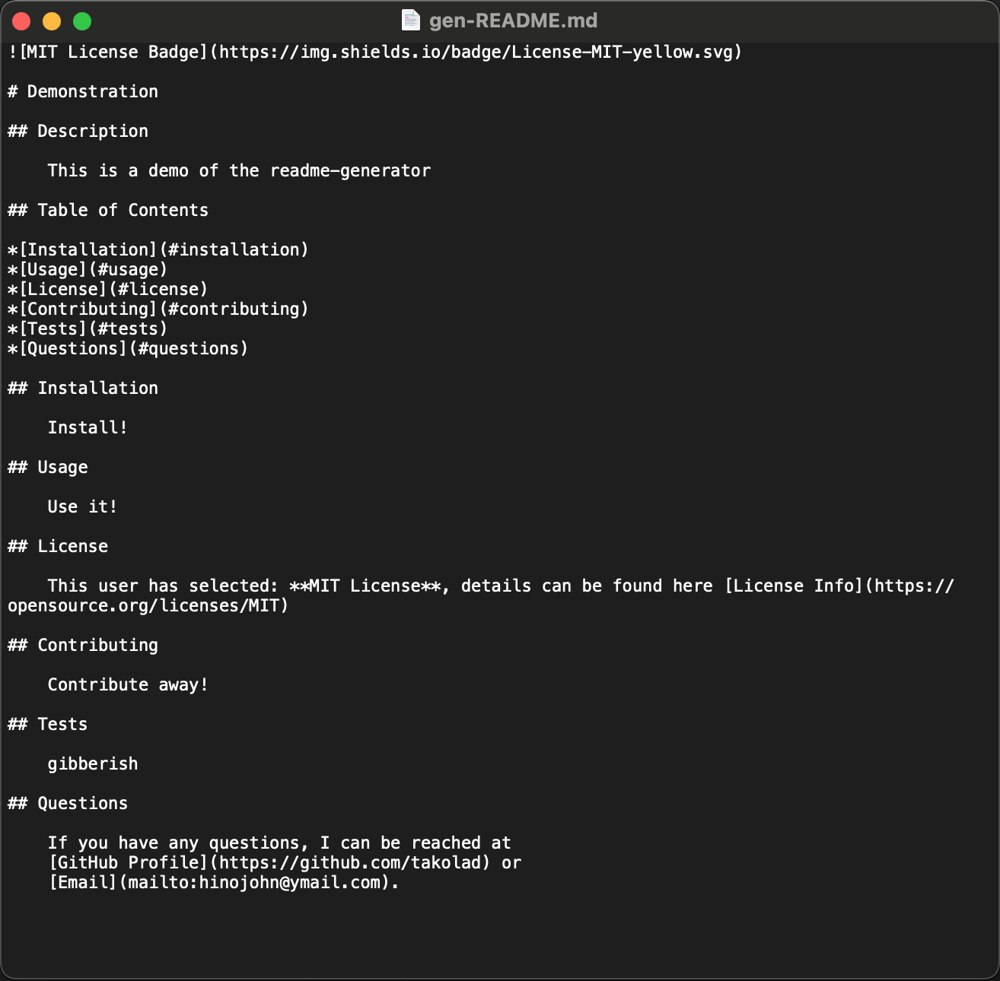

# readme-generator

## Description
    A Node.js powered Professional Grade README Generator.  
    By taking a user's input through a command-line interface a  
    README can be quickly generated, allowing more time  
    to work on their own projects.

## Table of Contents

*[Installation](#installation)
*[Usage](#usage)
*[Screens](#screens)
*[License](#license)
*[Questions](#questions)

## Installation

Download the files from [my repo](https://github.com/takolad/readme-generator).
This application requires **Node.js** to run.  
In a *command-line interface* (PowerShell, CMD, Terminal) run `node -v` to see if Node is already installed, if not it can be downloaded from [Node.js](https://nodejs.org/en/download/).

## Usage

To use this application first have the associated directory, **readme-generator**, as your *working directory*.  
Then type `node index.js` to run the app, then fill in information about your product.

## Screens

   
   

## License

   
   [MIT License](https://opensource.org/licenses/MIT)

## Questions

   If you have any questions, comments, or concerns I can be reached at my [GitHub Profile](https://github.com/takolad).